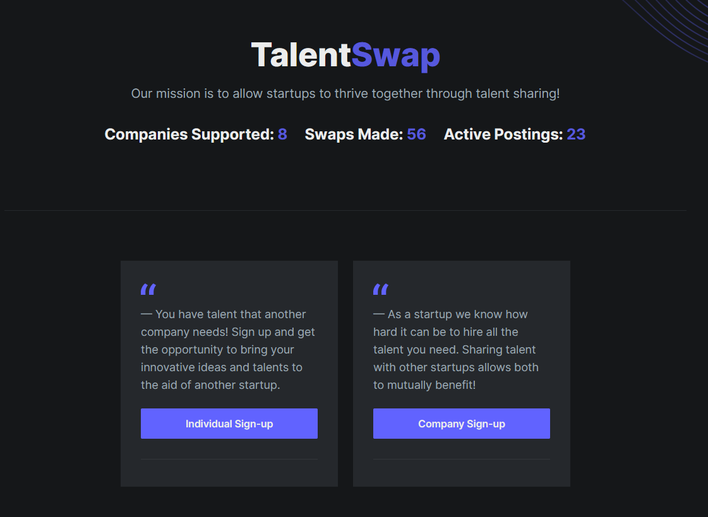

# TalentSwap - AmpHacks 2020 Team 2

Talent Sharing for Startups: Startups have a small number of employees and may have a skill gap that they need for a project. They could use this app to “swap talent” with other startups for the mutual benefit of both (ie. Startup A may need a data scientist while Startup B needs a front-end developer, but neither have enough resources to hire an additional employee, thus they could “swap talent” for a small period of time).

Created by Team 2: Jordan Curnew, Ari Kaufman, Suvaena Laventhiran

